# 乐趣生活 V5.0 平台架构

## 架构原则

1. **模块化单体优先**：交易一致性、授权、账本和审计在一个进程与数据库事务内完成；只有边界和容量证据成熟后才拆服务。
2. **多端独立发布、能力共享**：消费者、经营宝、销售宝和城市服务商拥有独立 manifest、构建产物和发布周期，共享设计系统、信息架构契约与 API 契约。
3. **服务端是事实来源**：金额、券、佣金、结算、归属和 AI 风险决策不得在客户端作为最终结果计算。
4. **默认拒绝**：认证、权限、数据范围和字段权限逐层收窄；跨租户访问在业务查询前被拒绝。
5. **写操作可重放**：所有写接口必须携带幂等键，领域更新、审计、埋点和 Outbox 在同一事务提交。
6. **历史只追加**：审计、券账本和关键规则快照不可物理修改；退款、撤销和冲正通过追加记录表达。

## Monorepo 边界

```text
apps/
  admin-web/          统一 PC 后台与 1-6 级总部运营路由
  consumer-miniapp/   乐趣生活消费者端，独立 H5/微信构建
  merchant-miniapp/   经营宝，独立 H5/微信构建
  sales-miniapp/      销售宝，独立 H5/微信构建
  provider-miniapp/   城市服务商工作台，独立 H5/微信构建
  mobile/             五角色端到端闭环验收台
  api/                Fastify 模块化单体与 SQLite 本地适配器
packages/
  auth/               RBAC、数据范围、字段权限、AI 审批权限
  contracts/          API DTO、状态机与共享类型
  design-system/      Aurora Living 视觉令牌
  product-catalog/    四端 1-6 级产品信息架构
  mobile-ui/          跨端首页与层级导航组件源码
tools/
  sync-mobile-ui.mjs  将共享 SFC 与目录契约生成到各端本地编译边界
```

uni-app 的微信编译器不接受工作区外 SFC 产生的相对 chunk 路径，因此各端构建前运行受路径白名单约束的同步器。`packages/mobile-ui` 与 `packages/product-catalog` 是唯一源码；`apps/*/src/shared` 是可再生镜像，不允许手工编辑。

## 信任与写入链路

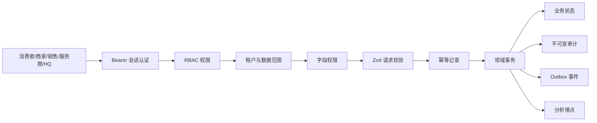

开发环境使用数据库内的哈希令牌会话适配器，生产环境必须替换为 OAuth 2.1/OIDC 适配器；追踪矩阵在生产适配器完成前不会把该项标记为完成。

## E1 商家入网领域

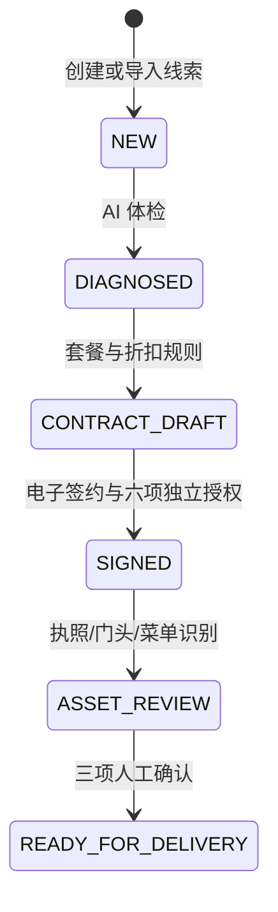

- 线索查询在 SQL 层执行租户、城市和归属范围过滤，前端不可扩大数据范围。
- 所有阶段变更携带实体版本与幂等键，过期客户端收到 `409 stale_entity_version`。
- 折扣不高于 5% 自动通过；更高折扣进入待审批状态，合同签署被服务端拒绝。
- 六项授权使用独立记录，不以单个布尔字段代替；后续可逐项撤回并追加证据。
- 识别结果与人工修订分别保存，只有三类资料均确认后才能进入服务商交付。
- 用户原件使用二进制流上传，限制 8MB；每次上传保存 SHA-256、MIME、字节数和只追加原件版本，本地 OCR 适配器可替换为生产连接器。
- 跟进记录只追加保存，下一动作同步回线索；失单使用结构化原因，不以删除线索代替。
- 超过 5% 的合同折扣进入待审批状态，只有具备折扣审批权限的角色可决定并推进新合同版本。
- 领域状态、业务时间线、审计、埋点和 Outbox 在同一事务提交；时间线禁止更新和删除。

## E2 MiniApp Factory 领域

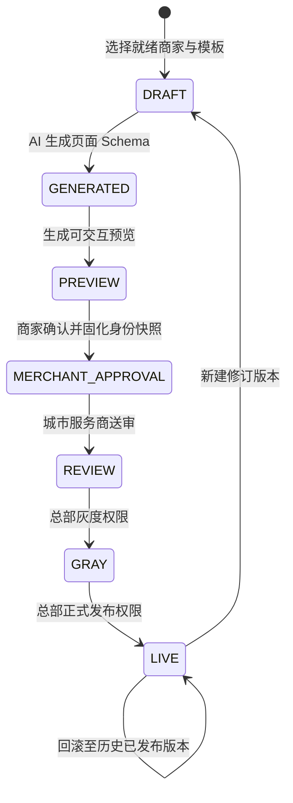

- 项目只能绑定已经完成 E1 且处于 `READY_FOR_DELIVERY` 的商家，服务端校验替代客户端信任。
- 模板和页面区块采用服务端白名单 Schema；生成结果记录模板、主题、模型版本和结构化页面，不执行模型返回的任意代码。
- 商家确认保存确认人、角色、时间和版本快照；后续修订不会覆盖既有确认与发布证据。
- 城市交付角色可创建、生成、预览和送审，但灰度与正式发布必须具备 `miniapp.release` 权限。
- 每次生成、发布和回滚都创建独立版本；事件、审计、埋点和 Outbox 只追加且与项目状态同事务提交。
- 回滚只允许选择曾经正式发布的版本，并追加新的回滚证据，不删除失败版本。

## E3 GEO OS 领域

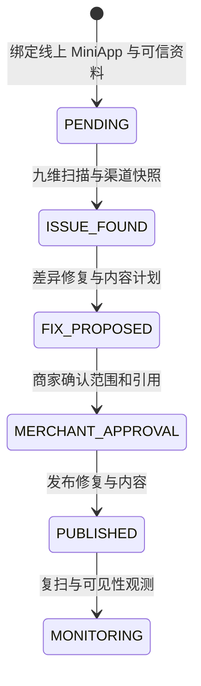

- GEO 工作区只能绑定 `LIVE` 且存在发布版本的 MiniApp 项目，确保实体资料链路从 E1、E2 顺序继承。
- 健康分使用 V5.0 冻结九维权重：15/15/15/15/10/10/10/5/5；每次得分保存规则版本与九项维度快照。
- 标准实体保存品牌、门店、POI、别名、坐标、来源与置信度；Merchant Fact 保存字段值、来源类型、来源引用、置信度和核验状态。
- 商家档案、MiniApp 与两个地图适配器使用统一字段键映射；原始观察值、标准值和一致性状态按扫描版本只追加。
- 每个修复保留当前值、建议值、渠道、严重级别和审批状态；内容计划中的每条内容必须引用至少一个 Merchant Fact。
- 商家确认同时覆盖修复范围和内容引用，发布不能绕过确认；事件、审计、埋点与 Outbox 在同一事务写入。
- 观测只存渠道聚合的提及、访问、咨询与订单，标注归因模型并明确“归因不等于因果”。
- 产品和事件明确禁止第三方 AI 排名、推荐与无依据增长承诺；自动化承诺文本拦截器仍在追踪矩阵中保持未完成。

## E4 Skill Network 领域

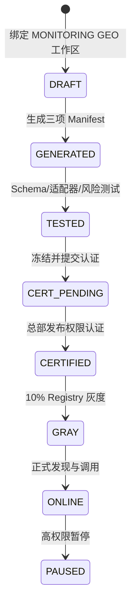

- 套件只能继承 `MONITORING` GEO 工作区，沿用已验证实体、事实来源和 Skill 独立授权范围。
- 每项 Manifest 固化 skill/version、tenant/merchant/store、描述、输入输出 Schema、Scope、风险、确认、超时、重试、幂等、SLA 与适配器。
- `get_menu` 为 L1/L0 只读能力，`find_table` 为 L2/L1 交互能力，`reserve_table` 为 L3/L2 交易草稿能力并强制用户确认。
- 每个 Skill 在认证前执行输入 Schema、输出 Schema、适配器合同和风险策略四组测试；三项共 12 组且测试记录只追加。
- 城市交付可生成、测试和送审，但认证、灰度、正式上线与暂停需要 `skill.release` 权限。
- 在线调用携带独立幂等键，策略先检查强确认，再执行适配器并校验输出；调用记录保存尝试次数、延迟和校验结果且禁止修改删除。
- 成功率、P95、可用率、投诉和退款按套件聚合；当前本地适配器用于契约验收，生产 Runtime 的真实重试/熔断与版本回滚仍在追踪矩阵中保持进行中。

## E5 经营宝领域

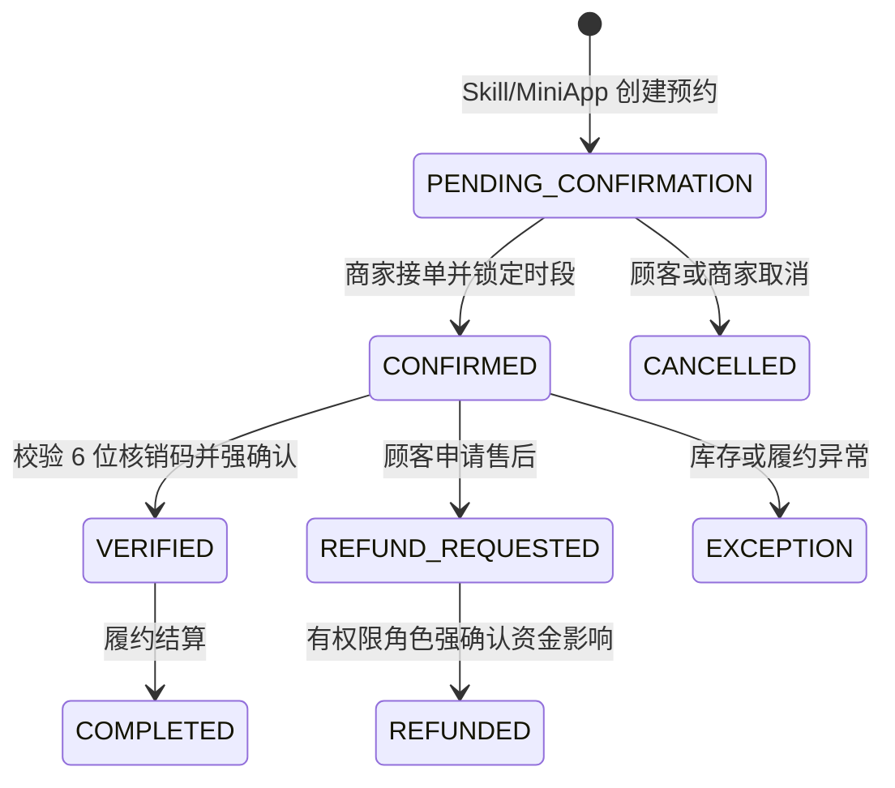

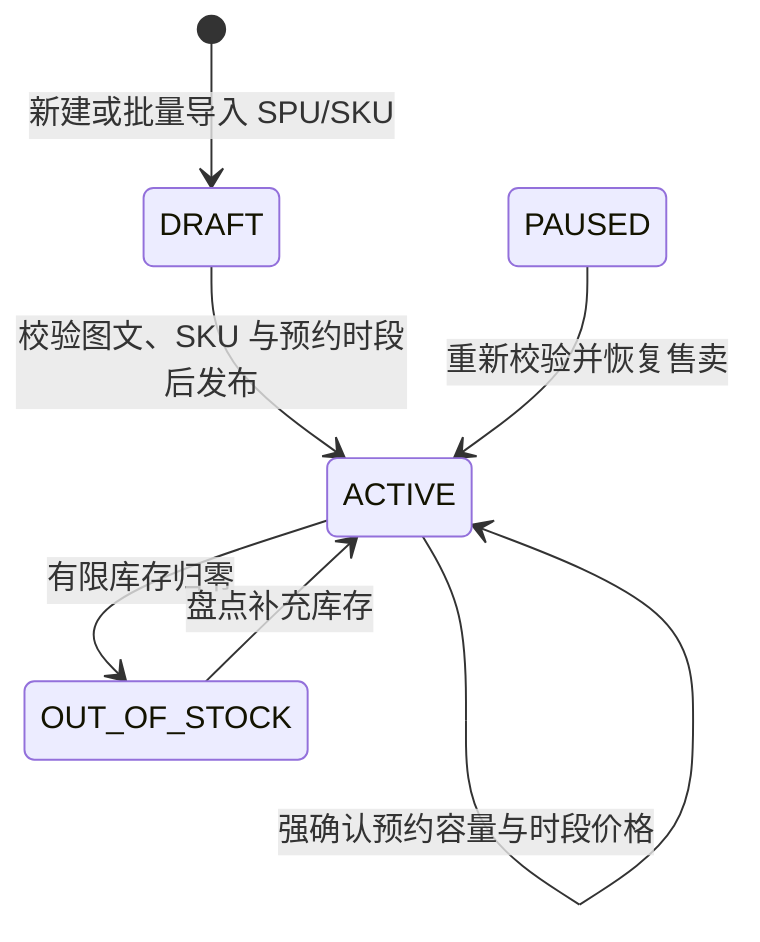

- 今日页只呈现实收、订单、新增会员、核销率、AI 健康分、三条建议、三条最高优先待办和异常，复杂趋势下沉到经营分析。
- 门店、七日经营快照、三类聚合订单、AI 建议和订单事件全部使用租户、商家、门店数据边界；城市交付可只读，不能代商家履约。
- 经营分析从同一指标口径提供七日收入/订单趋势、渠道贡献、时段表现和到访—下单—核销漏斗，并标注归因模型与非收益承诺。
- 预约确认、核销和退款均使用订单版本乐观锁与独立幂等键；核销校验完整 6 位码，退款校验申请金额、原支付金额和角色权限。
- 核销和退款为 L2 强确认动作，页面在执行前展示订单、顾客脱敏信息、金额和不可逆影响；成功后 AI 建议、待办和指标同步收敛。
- 每次状态变化同步追加领域事件、审计、埋点与 Outbox；`merchant_order_events` 通过数据库触发器禁止修改和删除。
- 商品目录按 Catalog—SPU—SKU 建模，商品、服务、套餐共享主模型；SKU 独立保存价格规则版本、有限/无限/预约库存模式和低库存阈值。
- 草稿发布在服务端强制校验 80% 图文完整度、至少一个 SKU，以及预约型 SKU 的可用时段；页面状态不能绕过领域规则。
- 改价必须强确认新旧价格、原因和渠道影响，并创建新价格规则版本；库存按差量入账，归零自动售罄，非有限库存拒绝数量调整。
- 预约时段独立保存星期、起止时间、容量、已预约量和价格覆盖；新容量不能低于既有预约，容量和时段价格变更均需强确认。
- 批量导入采用“模板预检—错误定位—强确认应用”两阶段协议，最多 50 行；重复编码、价格、图文完整度和库存规则在写入前统一校验，成功记录创建为草稿。
- 商品事件、导入记录、审计、埋点和 Outbox 与业务写入同事务提交；`merchant_catalog_events` 通过数据库触发器禁止修改和删除。
- 会员以新客、活跃、沉睡和高价值四类门店分层呈现，分层规则固定为 `member-segment-v1`；标签、订单数、终身价值、平均客单与最近到店构成可钻取画像。
- 复购概率和流失风险保存 `repurchase-local-v1` 模型版本与结构化解释依据，页面明确其为经营辅助判断而非收益承诺。
- 会员时间线只追加记录加入、订单、到店、标签、权益与召回计划；标签变更使用会员版本乐观锁，不覆盖历史。
- 权益发放固化类型、面值、有效期与 `member-benefit-v1` 规则版本，并要求商家强确认真实履约责任。
- 召回任务在服务端按“交易支付会员”独立授权过滤人群，已撤权会员自动排除；当前只创建 `SCHEDULED` 任务和审批证据，不伪造微信或短信已发送结果。
- 会员事件、时间线、审计、埋点和 Outbox 同事务写入；`merchant_member_timeline` 与 `merchant_member_events` 均由数据库触发器禁止修改和删除。
- 当前完成的是今日页、经营分析、订单履约、商品/服务目录和会员域的纵向实现；会员域已完成 375px 浏览器验收，营销、财务与完整售后域仍以追踪矩阵为准。

## E6 销售宝领域

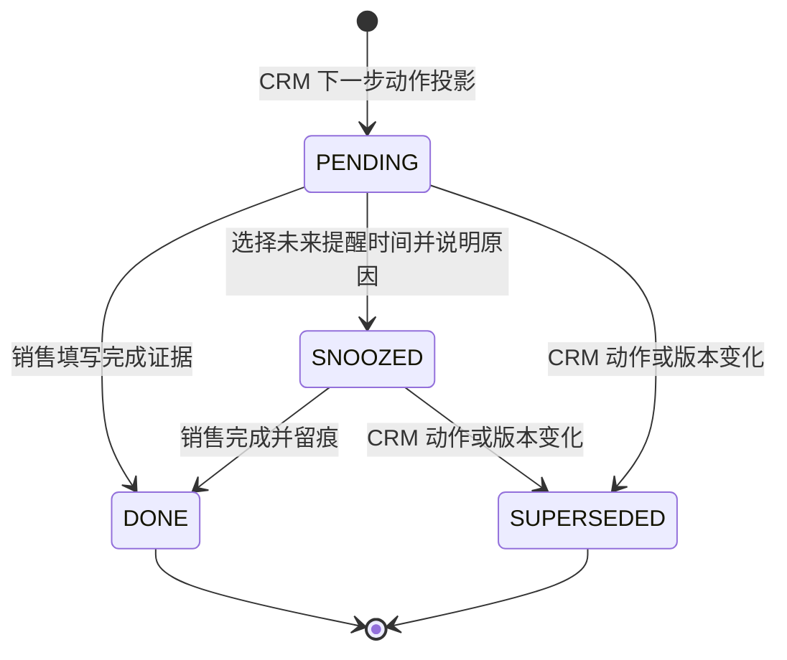

- `sales_tasks` 是 CRM 下一步动作的可执行投影，使用线索版本与动作内容生成稳定 `source_ref`；同一版本不会重复建任务。
- CRM 下一步动作变化时，旧 `PENDING/SNOOZED` 任务变为 `SUPERSEDED`，新任务保存新的线索版本、截止时间、提醒时间、类型和优先级。
- 今日工作台从同一数据范围聚合今日/逾期/已完成任务、保护期线索、本月已签收入、预计佣金和重点商机，不复制线索主数据。
- 重点商机和下一步建议由 `sales-next-best-action-v1` 规则策略与 `sales-assist-local-v1` 本地辅助模型生成，返回推荐分、三项解释依据、建议打法和明确护栏。
- AI 建议不自动联系商家、不替销售承诺，也不修改 CRM 阶段；实际线索跟进、合同、授权和交付仍由 E1 领域接口执行。
- 完成任务要求结果证据；稍后提醒限制在未来 30 天并要求原因。两种写入均使用任务版本乐观锁、独立幂等键和 `lead.write` 权限。
- 每次任务动作同步追加 `sales_task_events`、CRM `lead_activities`、审计、埋点与 Outbox；任务事件由数据库触发器禁止修改和删除。
- 任务查询与写入复用线索 SQL 数据范围：平台/城市角色按范围读取，自有商家范围只读取本人或协作线索，商户角色没有销售工作台权限。
- 商家 CRM 查询同样先在 SQL 层应用租户、城市、负责人和协作者范围，再聚合跟进次数、最近跟进、活动数、保护期、争议与逾期状态；前端筛选不能扩大服务端数据范围。
- `lead_locations` 把坐标、行政区、地理编码来源、置信度和乐观版本作为独立位置事实保存；地图只渲染存在可信位置的线索，未定位线索继续保留在列表，绝不以默认中心冒充商家坐标。
- 列表和地图返回同一份 `SalesCrmOverview` 读模型；两种入口都携带精确 `focusLeadId` 进入 E1 详情，跟进写入后重新读取聚合模型，避免前端复制或猜测时间线状态。
- 归属变更使用申请/裁决分离模型：城市销售只提交 `lead_transfer_requests`，城市经理或总部角色在服务端校验同城目标、申请版本、线索版本与数据范围后裁决，任何角色都不能绕过申请直接改负责人。
- 申诉和转移申请互斥：存在待裁决申诉时冻结新转移，存在待审转移时禁止新申诉；裁决通过后重新起算 30 天保护期，避免并发流程覆盖归属结论。
- 转移批准在同一事务中更新负责人、保护期、活动销售任务和原负责人 `OBSERVER` 协作关系；驳回不改变归属或保护期，过期上下文通过乐观版本拒绝。
- `lead_ownership_events` 保存转移申请、批准/驳回、申诉提交、通过/驳回与协作变更，数据库触发器禁止更新和删除；业务写入同时追加审计、埋点和 Outbox。
- 归属中心读模型将负责人、保护状态、候选人、协作者、申诉、转移和不可变证据一次返回；写权限与可执行动作由服务端给出，页面不自行推断越权能力。
- `sales_target_revisions` 以销售、月份和递增版本保存签约、续费、交易三类目标；负责人修订时必须提交当前版本与业务原因，只追加新版本，旧目标禁止更新和删除。
- `sales_commission_ledger` 使用 `RECOGNITION / SETTLEMENT / REVERSAL` 三类只追加流水表达状态：确认事实增加业绩和预计佣金；结算流水把预计金额等额迁移到已结；退款或撤销流水同时抵销剩余业绩及预计/已结佣金。
- 每条佣金流水固化计提基数、比例、公式、规则版本、来源边界、业务原因与证据；交易分成只消费结算域确认的事实，不在销售宝重算订单、代金券或平台分润。
- 业绩读模型按 SQL 数据范围聚合个人或城市团队，销售只能读取本人，城市负责人可查看团队、钻取成员和修订目标，只有财务权限可结算或冲正佣金。
- 销售宝今日页的本月签约与预计佣金复用同一只追加账本，避免首页和业绩中心出现两套口径；所有目标、结算和冲正写入同步审计、埋点与 Outbox。
- `sales_team_units` 与 `sales_team_members` 保存城市—小队组织关系、当前职级、在职状态、培养关系与乐观版本；组织读取先应用租户和城市范围，销售只能钻取本人，城市负责人和总部角色才可查看成员详情。
- `sales_performance_scorecards` 按人员、月份和版本固化结果、商机、过程、质量、合规五维评分、能力快照、来源快照与模型版本；评分卡只追加，排行使用服务端 `70% 综合绩效 + 30% 目标达成`，并明确合规门槛和同分规则。
- 晋降级使用 `sales_level_change_events` 表达 `REQUESTED / APPROVED / REJECTED` 事件流：城市负责人只能发起相邻一级申请，总部人才校准角色才能审批；批准前不修改职级，批准时以成员版本和发起职级双重校验后生效。
- `sales_coaching_plans` 保存培养计划当前状态，`sales_coaching_events` 只追加创建、阶段复盘、完成或取消证据；计划必须包含目标、能力焦点、行动清单、成功标准、截止日期和下一次复盘时间。
- 团队成长写操作与审计、埋点和 Outbox 同事务提交；绩效卡、职级事件、培养事件由数据库触发器禁止更新和删除，AI 只给建议，不能直接晋升、降级或虚构培养完成。
- AI 销售助手通过 `SalesAiProvider` 边界隔离生成能力；当前 `lequ-evidence-copilot` 使用已授权 CRM、体检、跟进、合同与策略事实，固定返回 provider、模型、提示词和人控策略版本，后续可替换生产模型而不改变领域契约。
- 拜访简报、顾问话术、会议纪要、下一步建议和价值提案统一保存到 `sales_ai_artifact_revisions`；每次重生成和人工确认都追加新版本，草稿生成不会联系商家、承诺结果或修改 CRM 阶段。
- 会议纪要只有在销售核对摘要、下一步、时间和渠道并完成强确认后，才在同一事务追加 `lead_followups`、更新线索乐观版本并写入 CRM 活动、审计、埋点与 Outbox。
- 异议模拟使用 `sales_ai_sessions` 与只追加 `sales_ai_roleplay_turns` 保存客户、销售、AI 教练三方轮次；评分覆盖共情、证据、合规和下一步，不产生外部触达，并识别“不会承诺”等否定语义以避免合规误判。
- `sales_ai_artifact_revisions`、`sales_ai_roleplay_turns` 与 `sales_ai_events` 均由数据库触发器禁止更新和删除；仅具备 `sales.copilot.use` 与对应线索读取/写入权限的销售或管理角色可使用。

## E7 城市服务商领域

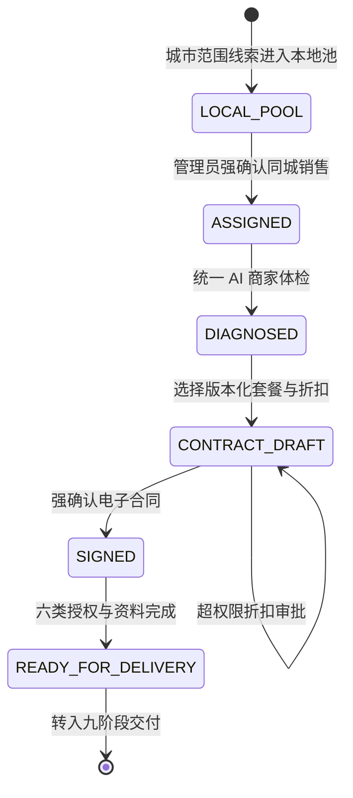

- `CITY_PROVIDER_ADMIN` 是城市服务商工作台的城市级管理角色，可在本城市完成线索分配、体检、合同、MiniApp/GEO/Skill 交付管理，但不能配置全国平台、发布 MiniApp/Skill 或使用销售 AI 私域能力。
- 本地线索池读模型先在 SQL 层应用租户和城市范围，再聚合负责人、健康分、合同、六类授权、下一动作、逾期、销售负载和套餐目录；搜索与阶段筛选只在已授权结果内收窄。
- 负责人调整要求 L2 强确认、线索乐观版本、同租户同城在岗销售和独立幂等键；成功后线索负责人及未完成销售任务在同一事务迁移，保护期与原业务下一步不会被静默改写。
- `provider_lead_assignment_events` 保存前后负责人、操作者、原因、线索版本和 `provider-lead-assignment-v1` 规则版本，并由数据库触发器禁止修改或删除；同一事务追加 CRM 活动、审计、埋点和 Outbox。
- 四档套餐由 `provider-package-catalog-2026.07` 固化能力与年度目录价；合同价只在服务端按基点折扣计算，5% 以内自动通过，超过边界必须先审批。
- 城市服务商复用 E1 的体检、电子合同和授权领域服务，不复制评分、价格、签约或授权逻辑；签约后生成六条独立授权事实，再进入既有九阶段交付入口。
- 服务商端本地增长中心提供城市指挥盘、线索池、搜索/阶段筛选、签约主链、体检报告、套餐目录、合同授权、销售容量和不可变分配记录，并在 375px H5 与微信小程序构建中共用同一业务组件。

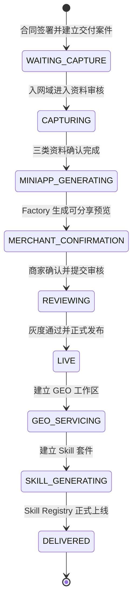

- `provider_delivery_cases` 只保存案件负责人、优先级和 168 小时总 SLA，不复制入网、MiniApp、GEO 或 Skill 的业务状态；签约和历史数据回填都会幂等建立唯一案件。
- `provider-delivery-projection-v1` 按 E1 入网、E2 MiniApp Factory、E3 GEO OS、E4 Skill Network 的权威状态实时推导九阶段、完成率、阶段停留、下一步与来源状态，避免多套状态漂移。
- 阶段目标依次为 4/12/24/36/48/60/108/156/168 小时；看板统一标记正常、临期、逾期和已完成，并按城市 SQL 数据范围隔离案件。
- `provider_delivery_case_events` 保存案件建立等交付事实并由数据库禁止修改或删除；页面证据流同时汇聚入网活动、Factory、GEO 与 Skill 事件，保留来源、操作者和时间。
- 服务商端九阶段页面提供全城阶段轨道、案件队列、负责人、下一最佳动作、SLA、四域状态链和统一证据；主操作携带精确业务 ID 深链对应权威工作区。

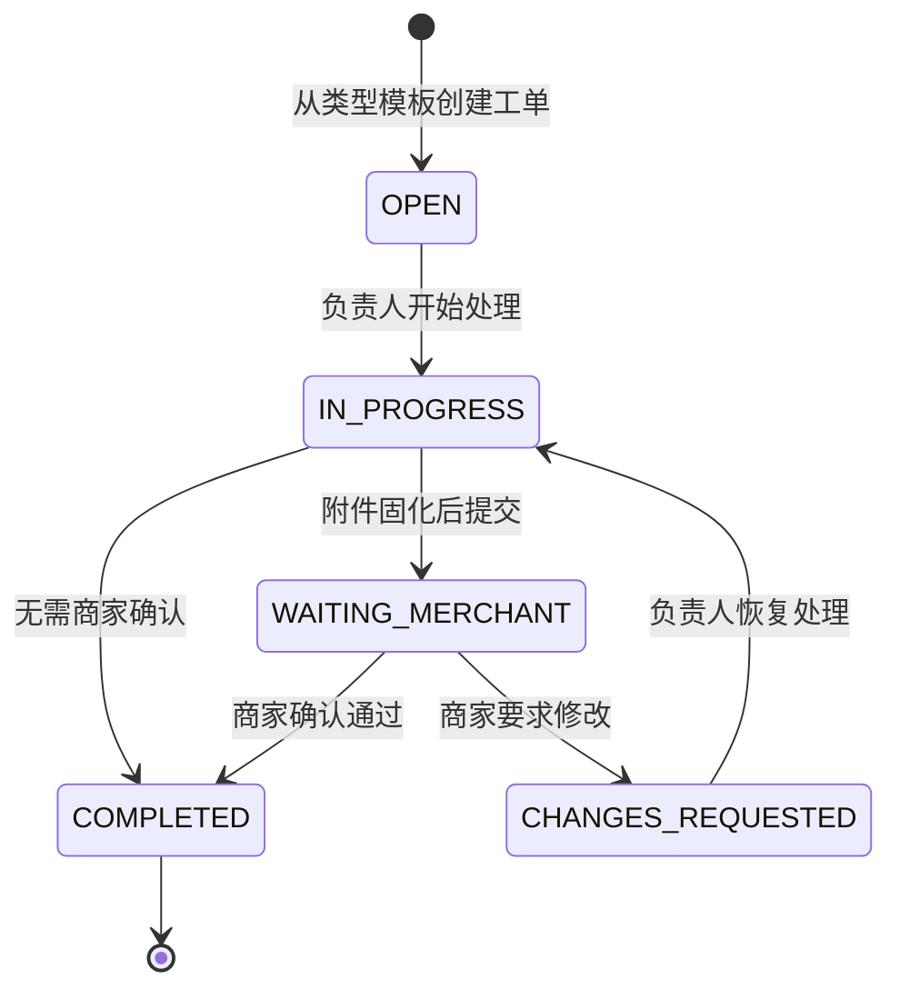

- 工单目录提供资料采集、小程序配置、商家审阅、平台审核、GEO 优化、Skill 激活、交付验收和其他协作八类服务端模板；默认时限、建议阶段与商家确认策略均由 `provider-work-order-policy-v1` 固化。
- 工单在 SQL 层按租户和城市隔离，并校验负责人必须是同城在岗交付或管理角色；销售角色不能读取工单池，交付角色可以处理但不能代商家确认，形成职责分离。
- 负责人调整、开始、提交、退回恢复和商家确认均要求幂等键与乐观版本；高风险调整、提交及确认还要求 L2 强确认，并在同一事务写入审计、埋点、Outbox 和只追加工单事件。
- 附件以原始二进制保存，限制 JPG、PNG、WebP、PDF、TXT 和单文件 8MB，固化文件名、MIME、大小、SHA-256、上传人与工单版本；附件、商家确认快照和事件均由数据库触发器禁止更新或删除。
- SLA 状态由服务端根据截止时间实时推导为正常、临期、逾期或已完成；本批提供可信逾期事实和工作队列，自动升级作为追踪矩阵中的下一项独立能力继续开发。
- 服务商端 Work Order OS 在同一页面提供城市案件、工单队列、负责人负载、八类创建向导、附件证据、商家实名确认和完整时间线；H5 使用浏览器文件选择器，微信端使用小程序文件 API，二者复用同一领域接口。

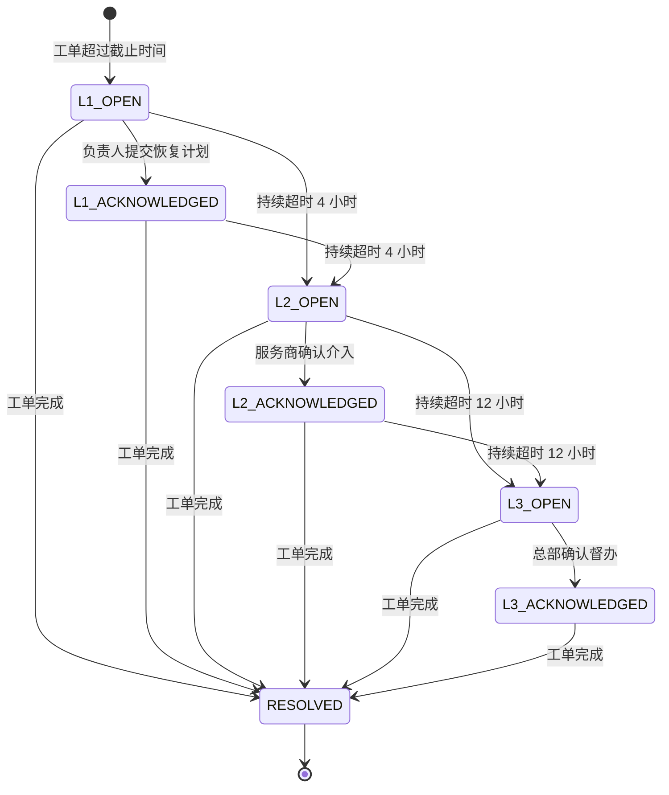

- `provider-delivery-sla-policy-v1` 固化三级规则：刚超时建立 L1 并面向负责人/城市经理，持续 4 小时升级 L2 服务商管理员，持续 12 小时升级 L3 总部运营；规则、接收角色和响应预期均通过 API 返回，不在前端计算。
- API 进程内调度器每 60 秒按租户和城市 SQL 范围扫描真实工单截止时间；扫描天然幂等，首次发现已跨越多级阈值时会按顺序补齐 L1/L2/L3 事实，重复扫描不会重复升级。
- `provider_delivery_sla_incidents` 保存当前层级、响应状态、恢复计划和乐观版本；`provider_delivery_sla_events` 只追加发现、升级、确认和关闭事实，并由数据库触发器禁止更新或删除。
- 每次发现、升级、确认和自动关闭均在同一事务写入审计、埋点与 Outbox；Outbox 明确标记 `PENDING_CONNECTOR`，在微信/短信连接器接入前不宣称外部消息已经送达。
- 交付人员只可确认本人负责的异常，城市经理、服务商管理员与总部可跨本数据范围处置；销售角色无权读取 SLA 指挥盘，人工确认要求强确认、幂等键和乐观版本。
- 工单完成后扫描器自动关闭仍在处理的 SLA 异常并追加关闭证据，不删除历史；SLA Control Room 提供三级策略轨道、异常队列、恢复计划、原工单深链和只追加升级时间线。

- `provider-city-metrics-v1` 不建立第二套经营事实表，而是在 SQL 城市范围内组合 CRM、签约/续费确认账本、交付完成、Skill 版本、交易和代金券权威域，形成 30/90/365 天只读投影。
- 城市商家以已签约、已建立交付案件、续费周期或 Skill 套件的去重线索为边界；活跃商家必须在周期内存在跟进、交付、续费、Skill 状态或确认账本事件，不能由前端自行标记。
- 服务收入只计 `SIGNING` / `RENEWAL` 的确认与冲正净额；交易 GMV 只计 `TRANSACTION_SHARE` 的确认与冲正净额；平均交付时长只接收 Skill 上线或已交付工单完成样本。
- Skill 可交易率、代金券启用率、续费率均同时返回分子、分母与冻结定义；无样本时返回零或空值而不做估算。服务商端提供周期趋势、风险信号、商家钻取、行业结构和数据新鲜度。
- `provider.metrics.read` 仅授予总部运营、城市服务商管理员和城市经理；城市销售、交付人员和商户角色不能读取整城收入，平台角色可聚合全国，城市角色在 SQL 层锁定授权城市。

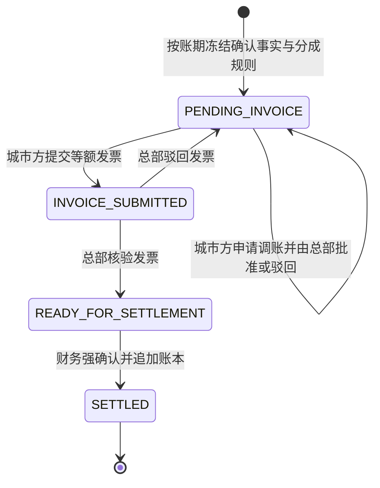

- `provider_city_settlement_statements` 按租户、城市和 `YYYY-MM` 账期唯一保存结算当前态，所有金额使用整数分；签约、续费和交易服务分成只消费 `sales_commission_ledger` 的确认与冲正净额，不在结算域复制业务成交状态。
- `provider_city_settlement_rules` 以独立版本保存签约、续费和交易服务分成基点，数据库禁止更新或删除；结算单与最终账本同时固化规则版本、公式和证据快照，历史账期不会被新规则静默重算。
- 城市服务商管理员与城市经理仅可在授权城市生成结算单、申请调账和提交发票；总部运营或超级管理员独立审批调账与发票，只有财务或总部超级管理员可执行结算，城市销售、交付和商户角色不能读取整城收益。
- 调账批准前不改变应付金额；存在待审批调账时禁止开票。发票金额必须与最终应付完全一致，核验通过后结算单锁定为待财务结算，任何版本变化都通过乐观锁拒绝陈旧请求。
- `provider_city_settlement_ledger` 和 `provider_city_settlement_events` 只允许追加；结算事务先写签约、续费、交易和已批准调账流水，再校验账本净额等于应付，最后更新结算单并通过 Outbox 发布 `settlement.completed.v1`。
- 生成、调账、验票和结算写接口均要求独立幂等键与强确认，并与审计、埋点、Outbox 同事务提交；城市范围在 SQL 查询与写入对象加载阶段生效，越权焦点统一返回不可见。
- 服务商端收益结算中心提供本期应收、年度应付/已结、分成构成、规则快照、月度结算单、发票控制、调账审批、不可改写账本和审计时间线；经营驾驶舱提供同级直达入口。

## E8 消费者端领域

- 消费者使用独立 `CONSUMER` 角色和 `SELF` 数据范围；服务端在加载首页、家庭成员、消息与搜索历史时以会话主体 `subject` 绑定 `userId`，家庭身份不能扩大到其他用户或其他家庭。
- 家庭成员是消费者本人会话下的显式业务上下文，不是新的登录身份。城市与家庭身份切换同时校验本人家庭归属、消费者资料版本和乐观锁，并以幂等键重放同一动作。
- 首页只聚合当前城市和家庭身份下的真实进行中事项、家庭待办、权益与最近服务；最近服务最多返回 5 项。语音与图片入口已进入带确认边界的助手，扫码仍只展示后续批次提示。
- 搜索只读取 `PUBLISHED` 发布快照、`PLATFORM_DISPLAY` 独立展示授权、营业中的门店，以及 `ACTIVE` Catalog/SPU/SKU；客户端筛选和推荐理由不能绕过这些服务端约束，也不允许付费排名。
- 原始搜索词只追加写入当前消费者私有历史。审计和埋点只保存 SHA-256 摘要，Outbox 不携带搜索事件或原始查询，避免通过运营链路泄露个人意图。
- 消息正文和消息记录不可更新或删除；标记已读只允许推进本人消息的已读状态和版本，并与幂等、审计及埋点同事务提交。
- 消费者 AI 文本会话复用当前资料中的城市与家庭成员上下文；每次写入都再次校验上下文，避免页面停留期间切换身份后继续使用陈旧会话。会话、消息和风险事件均按本人 `userId` 隔离，消息和事件由数据库触发器禁止修改或删除。
- 语音输入以最多 8MB、0.5–60 秒的受限二进制上传建立私有 `PENDING_TRANSCRIPTION` 记录；原始音频只在待连接器阶段保留，签名成功或失败回调后立即删除。上传动作只投递 Outbox，不宣称转写成功。
- 转写回调是精确免 Bearer 路径，但必须通过 HMAC 签名和连接器事件幂等校验；成功结果只进入 `READY_FOR_CONFIRMATION`，转写原文不进入审计、埋点或 Outbox，证据只保存 SHA-256 摘要、置信度和状态。
- 消费者可以修改转写草稿，但必须提交 `confirmed: true` 和当前版本；确认后仍不会自动触达外部系统。只有将同一条已确认文本作为 `sourceVoiceInputId` 发送时，服务端才原子消费语音输入并复用既有文本助手、推荐和订座草稿链路。
- 图片输入以最多 8MB 的 JPEG/PNG/WebP 二进制建立私有 `PENDING_RECOGNITION` 记录；服务端同时校验扩展名、声明 MIME、文件魔数、图片尺寸不超过 4096×4096 且像素不超过 1200 万。该校验只阻断明显伪装和尺寸滥用，不冒充恶意内容或病毒扫描。
- 图片识别回调是精确免 Bearer 路径，但必须通过 HMAC 签名、事件幂等与冲突校验；成功和失败回调都会删除原图。成功结果只进入本人可见的 `READY_FOR_CONFIRMATION`，原始描述不进入审计、埋点或 Outbox，证据只保留摘要、类别、置信度、敏感数据标记和状态。
- 消费者可以编辑图片描述，但必须提交 `confirmed: true` 和当前版本；只有将完全一致的已确认描述作为 `sourceImageInputId` 发送时，服务端才原子推进为 `DISPATCHED` 并复用既有文本助手、推荐和订座草稿链路。
- 消费者门店详情只读取当前城市内 `PUBLISHED`、获 `PLATFORM_DISPLAY` 授权且营业中的门店，并联结 `ACTIVE` Catalog/SPU 与实时 SKU 价格、库存或预约容量。搜索、附近和助手推荐统一跳转该权威详情页，不能通过页面参数绕过发布、授权或城市边界。
- 团购与预约套餐使用独立发布记录冻结有效期、可用星期/时段、退款和核销规则，但价格、SKU 状态、有限库存和预约容量仍从经营宝权威目录实时读取。预约详情只下发与套餐星期/时段规则相交的真实槽位、剩余容量及覆盖价；停售、过期、库存不足或无有效时段时禁止建立草稿。
- 消费者核对规则后先建立 `WAITING_CONFIRMATION` 套餐草稿，冻结价格规则版本、套餐版本、数量和可选服务时间；预约草稿还写入不可变槽位 ID、配置版本、覆盖价与有效单价快照。建草稿事务不创建商户订单、不扣减库存或预约容量、不生成核销凭证、不发支付 Outbox；事件、审计与埋点只追加。
- 套餐强确认要求本人 SELF 范围、`confirmed: true`、当前草稿版本和按租户/用户隔离的幂等键；事务内重新核对城市/家庭上下文、门店展示授权、Catalog/SPU、套餐发布有效期、报价、价格规则版本、套餐版本、SKU 状态、槽位快照和资源余量。有限库存使用条件更新扣减，预约容量使用条件更新递增且不把占用变化混入配置版本；任一失败则订单、占用、快照和所有证据整体回滚。旧版预约草稿缺少槽位快照时返回专用重建错误，不误报资源不存在。
- 强确认后将有效单价、原价毛额、优惠额、数量、规则版本、套餐版本和有效期/退款/核销规则写入不可变订单快照。金额大于零只建立不晚于 15 分钟、套餐有效期或服务时间的 `HELD` 占用与 `PENDING_PROVIDER` 支付意图，绝不写已付金额；金额为零则不创建支付意图并将占用标记为 `CONSUMED`。待支付订单不进入经营宝接单待办，确认与核销 API 均再次阻断；调度器会幂等恢复资源、取消订单和支付意图，并同步消费者消息、审计、埋点及支付/订单取消 Outbox。
- 套餐支付连接器使用独立的免 Bearer、HMAC 验签入口。签名覆盖固定作用域、事件号、意图、连接器请求号、金额、币种、发生时间及类型专属字段；服务端在查询业务对象前先验签，再校验不可变订单快照、金额和币种。事件回执保存请求摘要、作用域和聚合对象，同事件同载荷可重放，不同载荷、跨订座/套餐命名空间事件号、跨聚合交易号或退款号一律冲突拒绝。
- 及时 `PAYMENT_SUCCEEDED` 只把实际已付金额写入权威商户订单、把支付意图推进为 `SUCCEEDED` 并将 `HELD` 占用转为 `CONSUMED`；商户订单仍保持待接单，由经营宝显式接单。`PAYMENT_FAILED` 原子取消订单和结算、释放库存或预约容量。到期、取消或资源已释放后的迟到成功只记录真实收款为 `LATE_SUCCEEDED`，绝不复活订单或重新占用资源，并自动建立精确全额补偿退款请求、尝试及 Outbox。
- 经营宝仅在零支付或套餐支付成功、资源状态有效且不存在退款阻断时开放接单。接单后服务端签发一次性 6 位 HMAC 派生核销凭证：消费者读模型可获得完整码，商家读模型只获得掩码，数据库只保存派生随机量、哈希和掩码；生产环境缺少独立凭证密钥时关闭签发。核销要求当前版本、完整 6 位码、未过期 `ISSUED` 凭证及可履约资金/占用状态，成功后凭证变为 `REDEEMED`、占用变为 `FULFILLED`，预约容量同步释放且有限团购库存不重复回补。
- 套餐取消和退款使用独立 SELF 权限、结构化原因、明确确认、乐观版本及按租户/消费者隔离的幂等键。待确认草稿或未实付、未履约订单可取消并原子释放资源；已支付订单只能申请全额退款。退款申请先撤销核销资格但不提前释放资源或声明资金退回，商家强确认后按精确退款尝试等待连接器；失败保持可重试，只有签名 `REFUND_SUCCEEDED` 才写实际退款、释放 `CONSUMED` 资源并收敛订单，旧失败尝试的迟到成功也可安全收敛而不会被后续失败降级。
- `consumer-intent-local-v1` 是本批可重复验收的本地意图适配器，不伪装为生产大模型。它只读取已发布、获 `PLATFORM_DISPLAY` 授权且营业中的门店与有效服务目录，最多返回 3 个选项；审计只保存提示词 SHA-256，不保存原文。
- 文本建议为 L0；包含订座意图时只建立 `WAITING_CONFIRMATION` 草稿，不创建订单、不扣款、不占用库存。用户提交 `confirmed: true` 且草稿版本、时间、城市和家庭身份仍有效后，才创建 `SKILL / RESERVATION / PENDING_CONFIRMATION` 商户订单，支付金额固定为零。
- 订座确认事务同步追加消费者风险事件、商户订单事件、审计、埋点、交易消息与 `consumer.reservation.submitted.v1` Outbox；Outbox 仅声明等待连接器处理，不宣称商家已确认。商家最终确认继续复用既有经营宝订单状态机。
- 订座草稿在提交商家前允许消费者按乐观版本修改 1–20 人及未来 90 天内的服务时间；保存只更新草稿和只追加证据，不创建订单或发送商家事件。草稿一旦提交即关闭编辑入口，避免订单与草稿产生双写分歧。
- 商家仍使用经营宝既有 `PENDING_CONFIRMATION → CONFIRMED` 动作。若订单来自消费者订座草稿，同一商户事务会递增草稿和会话版本、追加 `MERCHANT_RESERVATION_CONFIRMED` 助手事件并生成消费者交易消息；消费者读模型直接联结权威 `merchant_orders.status`，不复制第二套回执状态。
- 消费者取消要求独立权限、幂等键、草稿乐观版本、结构化原因和 `confirmed: true`。只允许服务开始前的 `PENDING_CONFIRMATION` / `CONFIRMED` 零支付订座；已支付订单必须进入退款域。成功后把权威订单推进到 `CANCELLED`，并同事务追加双方事件、消费者消息、审计、埋点和 `consumer.reservation.cancelled.v1` Outbox。
- 商家确认后，消费者可核对权威服务金额并生成 `PENDING_PROVIDER` 支付意图。此动作只追加 `consumer.payment.requested.v1` Outbox，不更新订单已付金额，也不返回伪造的客户端支付凭证；当前 `livePaymentConnectorAvailable=false`。
- 支付/退款回调是唯一免 Bearer 的业务路由，但必须通过独立 HMAC 签名。服务端按支付意图校验金额、币种和当前状态，并以 `providerEventId` 做幂等；只有 `PAYMENT_SUCCEEDED` 签名回调可以写入 `merchant_orders.paid_amount_fen`。
- 已支付订座不能走直接取消。消费者只能提交全额退款申请，把权威订单推进到 `REFUND_REQUESTED`；商家 L2 审批后仍保持待退款状态并发布连接器 Outbox，只有签名 `REFUND_SUCCEEDED` 回调才能推进到 `REFUNDED`。支付与退款事件表均禁止更新和删除。
- 消费者附近服务使用独立 `consumer.nearby.read` 权限，并再次校验当前资料中的城市和家庭成员；前端调用系统 `getLocation` 获得用户明示授权，精确坐标只存在于当次请求与页面内存，服务端不建立用户位置表，也不写入审计、埋点或 Outbox。
- `consumer_store_locations` 只保存门店位置事实，固化坐标来源、置信度和版本。附近查询只读取 `PUBLISHED`、`PLATFORM_DISPLAY`、营业中的门店；无可信坐标门店可保留在列表但不会出现在分布图，禁止以城市中心或默认坐标冒充门店位置。
- 授权成功时服务端使用 Haversine 公式计算直线距离并按距离排序，明确不代表步行、驾车或实时路程；拒绝授权、设备不可用或用户不授权时按当前城市口碑降级展示，不返回伪造距离。当前页面提供位置事实分布而非生产导航地图，地图瓦片、路线和实时交通仍属于连接器后续批次。

## 权限模型

- 角色：总部超级管理员、总部运营、AI 策略管理员、城市服务商管理员、城市经理、城市销售、城市交付、商户主理人、店长、店员、财务、消费者。
- 数据范围：平台、城市、自有商户、商户、门店、本人。
- 字段权限：顾客联系方式、身份材料和银行账户分别返回 `NONE`、`MASKED` 或 `FULL`。
- AI 风险：L0/L1 可直接执行；L2 需要业务审批权限；L3 仅允许总部超级管理员或 AI 策略管理员。

## 当前边界

四个独立小程序、统一 PC 后台及其 1-6 级产品导航、认证/RBAC 底座、12 步跨角色验收闭环，以及 E1 商家入网、E2 MiniApp Factory、E3 GEO OS、E4 Skill Network、E5 经营宝今日/分析/履约/商品/会员域、E6 销售宝今日任务、重点商机、商家 CRM、归属治理、业绩佣金、团队成长与 AI 销售助手、E7 城市服务商本地增长主链、九阶段交付看板、交付工单中心、SLA 自动升级、续费经营、城市经营指标和城市收益结算，以及 E8 消费者首页城市、消息、家庭身份、搜索、AI 文本会话、语音/图片上传、签名回调与明确确认、可编辑订座、商家回执、零支付取消、位置授权、附近列表、非导航位置分布、结构化支付确认、支付意图和退款审批边界已经可运行。消费者真实语音转写与图片识别连接器、图片恶意内容扫描、AI 位置理解、方案/比价、生产地图导航、真实微信支付商户连接器及其他叶子页仍以追踪矩阵为准；只有标为 `[x]` 的条目才视为完整交付。
