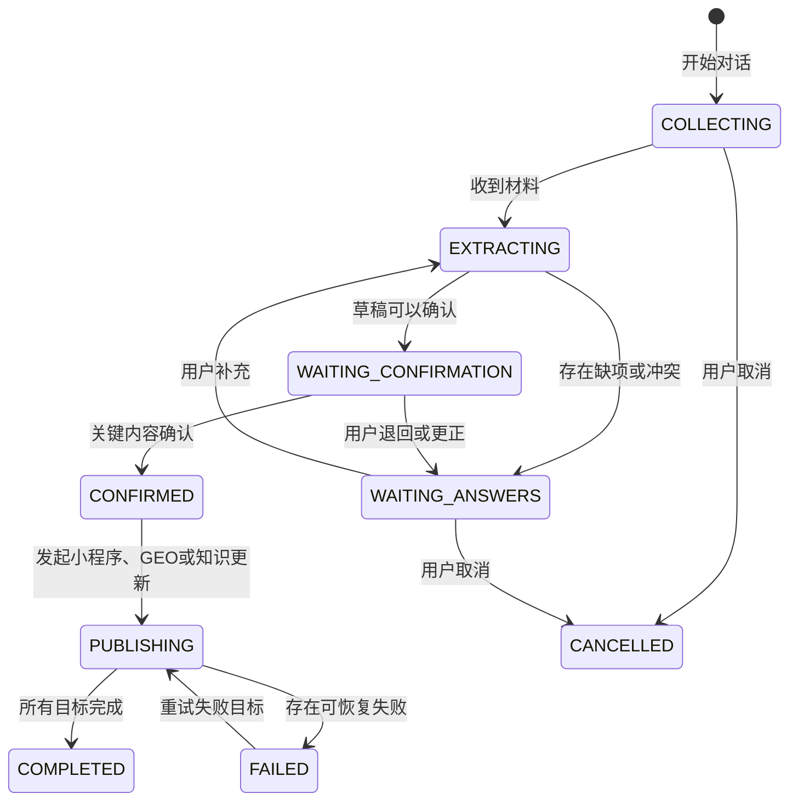

# AI对话建档状态机

## 会话状态

每份材料另有安全检查和识别状态。安全检查未通过时不能执行 OCR、转写或字段提取。

## 字段状态

字段依次经过待建议、已确认、已更正、已拒绝或冲突。法律主体、支付、价格、退款、公开联系方式和发布影响没有确认记录时，不能写入正式资料或公开发布。

## 恢复

网络中断、企业微信文件过期、OCR 失败、语音转写失败和外部发布失败不能删除原始材料。系统保存最近一步、错误编号和可重试动作。
