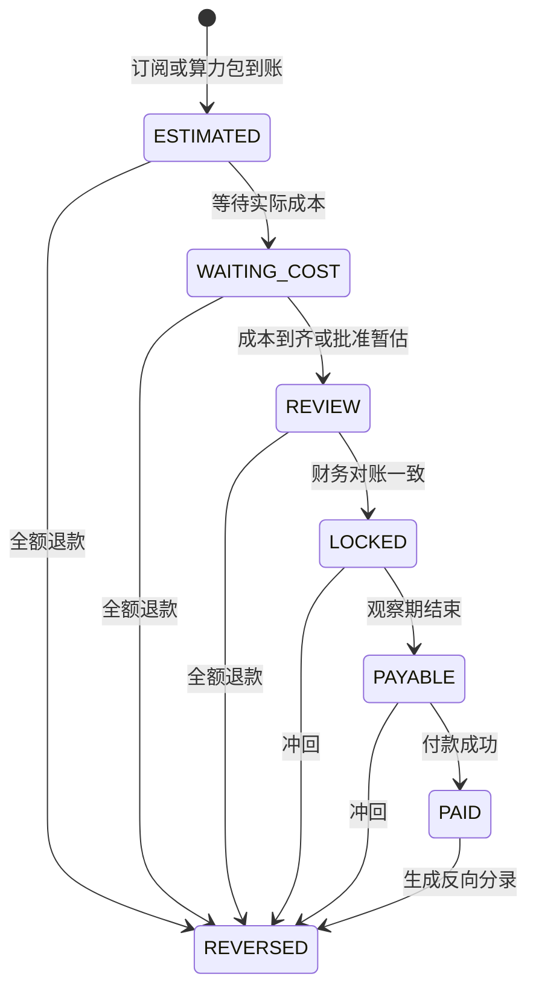

# 收益结算状态机

## 月结单

## 金额要求

- 可分配收益等于实际到账减退款和直接成本，最低为零。
- 订阅分配比例为商务人员 70%、尚智 10%、乐趣生活 20%。
- 算力包分配按是否存在有效区县服务商选择对应规则版本。
- 分配金额合计必须等于可分配收益。舍入产生的尾差按规则进入乐趣生活或乐趣宝，不得随机分配。
- 已付款记录不能修改，只能新增冲回分录。

## 暂估和补差

第三方账单未到时可以使用财务批准的暂估成本。实际成本到账后生成补差，不覆盖旧记录。商务人员可以看到暂估、实际和差额。

