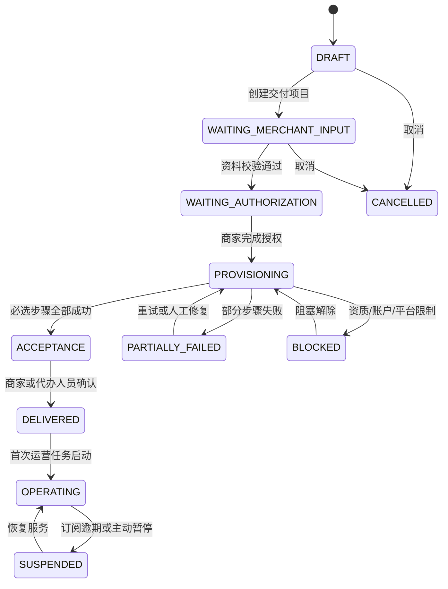
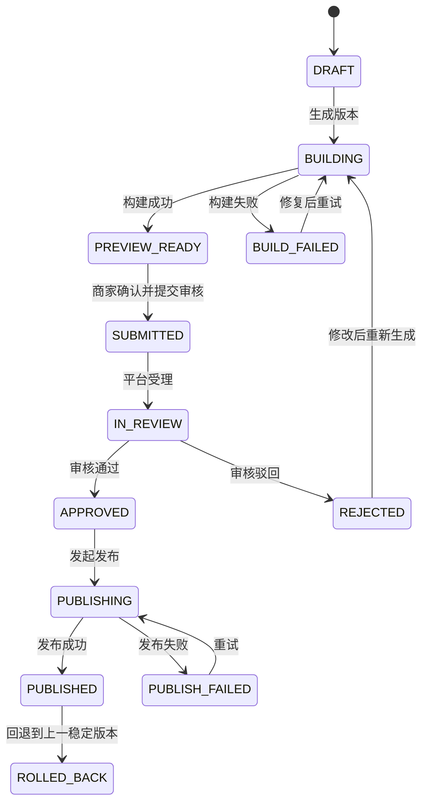
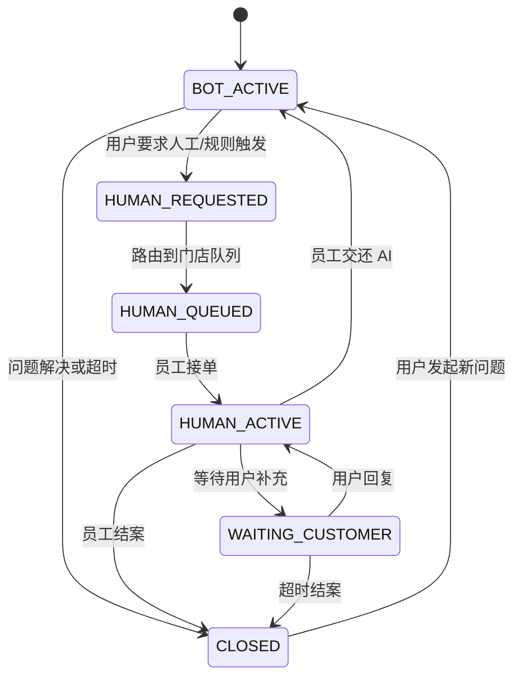
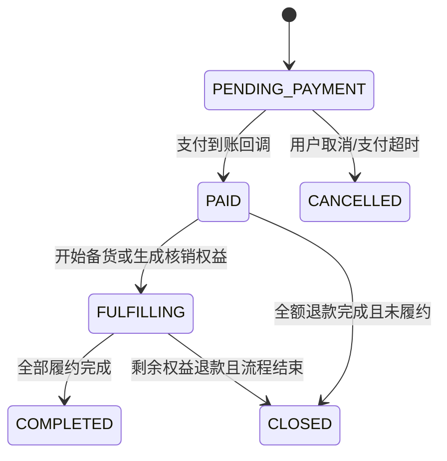
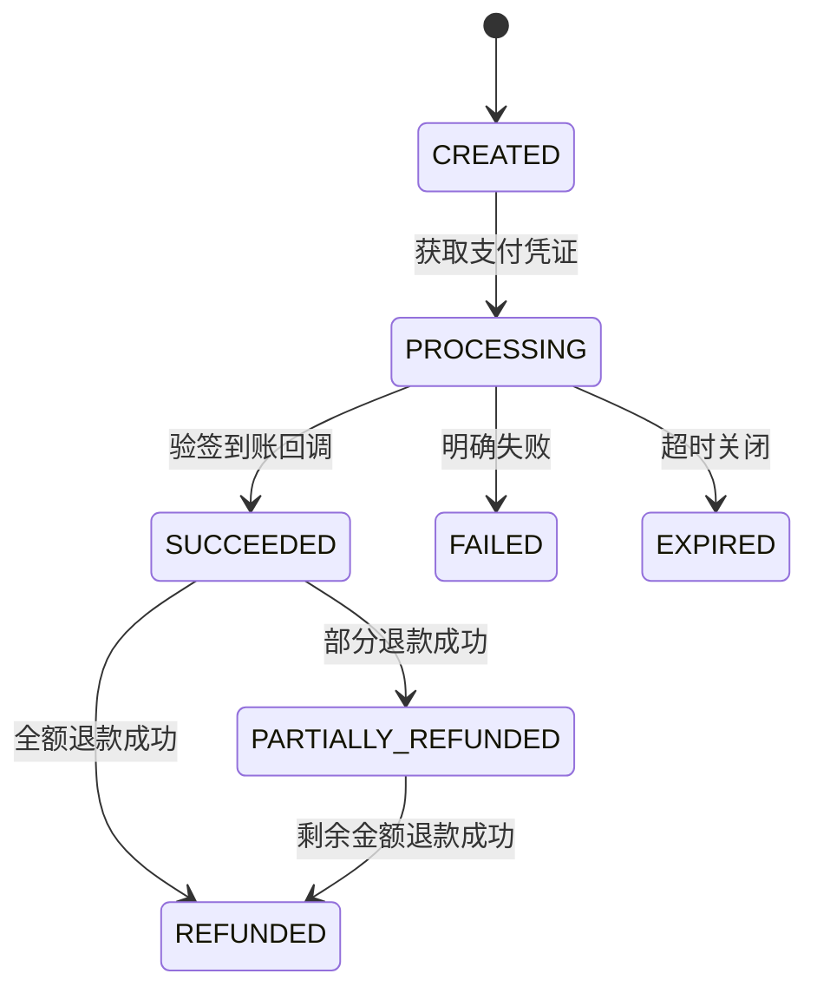
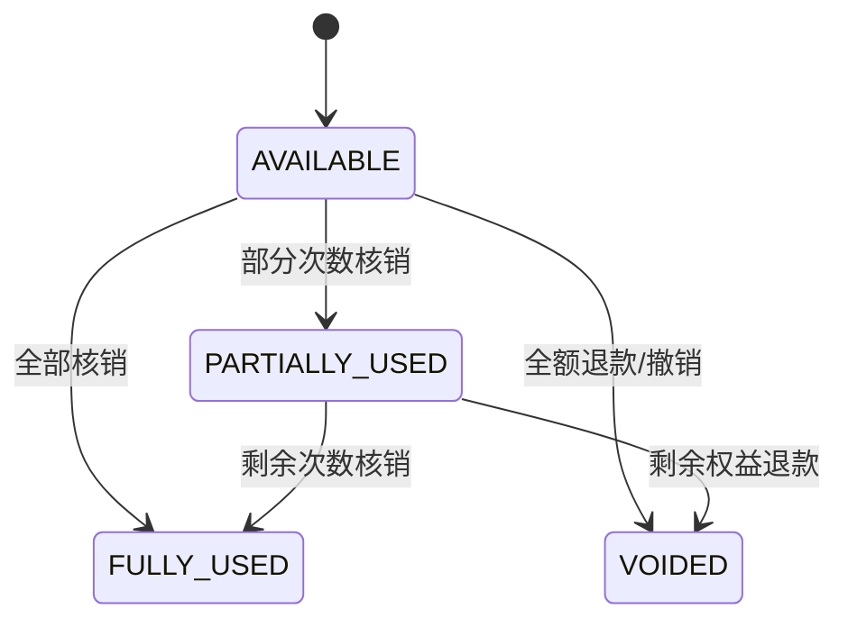
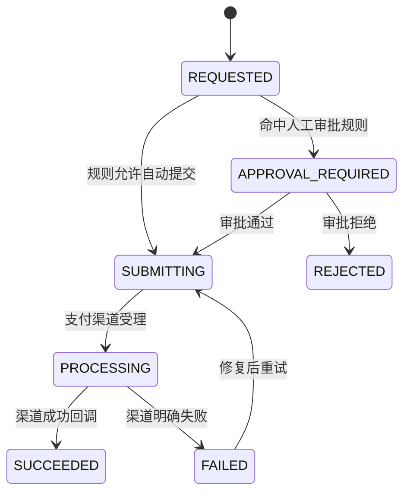
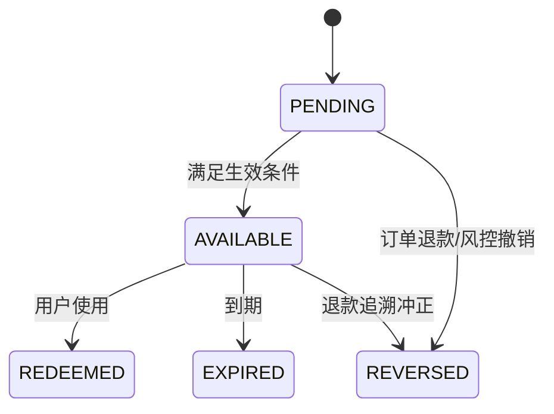
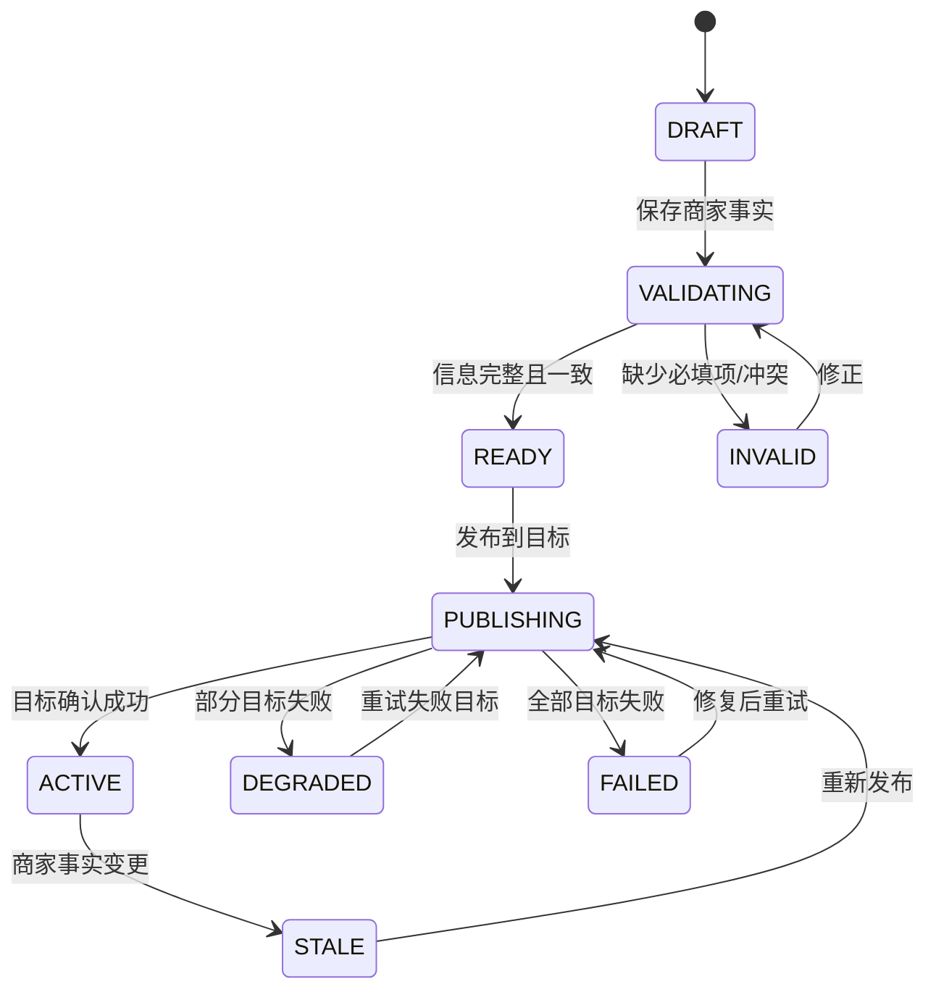

# 统一业务状态机

本文是乐趣宝、乐趣生活和商家独立小程序共用的状态契约。前端、服务端、工作流、报表和消息通知不得各自创造同义状态。

## 一、统一规则

1. 每个状态只归一个业务主体所有。订单状态、支付状态、退款状态、核销状态、奖励状态必须分开保存，禁止用一个“大状态”代替。
2. 所有修改状态的接口都使用“命令”语义，并提交 `expected_version`。版本不一致返回 `409 CONCURRENT_MODIFICATION`，调用方重新读取后再决定。
3. 每次成功迁移必须在同一数据库事务内：更新主体、增加版本号、写业务流水、写 Outbox 事件。
4. 支付、退款、微信审核等外部结果只接受签名校验通过的回调。前端跳转结果不能作为到账、退款成功或发布成功依据。
5. 重复命令必须返回第一次处理结果，不得再次扣款、发奖励、核销、退款或发布。所有写接口接受 `Idempotency-Key`。
6. 状态迁移由服务端校验。前端按钮隐藏只是体验处理，不是权限控制。
7. 状态时间使用 UTC 保存，界面按租户时区显示。金额统一以人民币分保存，禁止浮点数。
8. 所有异常都要落到明确状态、错误码和负责人，禁止只写日志后丢失任务。

## 二、一键交付项目

一键交付是顶层编排流程，不是单个插件。它调用商家建档、小程序、AI 客服、GEO、团购、物料和验收等能力。每个步骤有独立状态，总项目只汇总进度。

交付项目完成的必要条件：商家主体已确认、门店信息通过校验、商家自有 AppID 已授权、标准小程序已发布、AI 客服已完成问答验收、至少一个 GEO 发布目标成功、团购下单至核销流程验收通过、经营人员收到交接清单。

外部审核时间不计入平台交付时长。商家资料缺失、授权撤销、类目或资质不符时进入 `BLOCKED`，不得伪装成系统处理中。

## 三、小程序版本

- 名称、主体、AppID 归商家。模板、托管后端和平台源代码不随订阅转移。
- `SUBMITTED` 前必须保存商家对预览版、服务类目、隐私说明和版本说明的确认记录。
- 同一 AppID 同一时刻只能有一个发布命令运行。重复回调按平台回调编号去重。
- 回退是创建一个指向旧构建物的新发布动作，不删除历史版本。

## 四、AI 客服会话与人工接管

- 客户消息发生在商家小程序内的自研在线客服会话中。乐趣宝是员工处理后台。
- 企业微信只承担已授权员工身份、内部通知或工作入口；不得冒充员工向其个人微信或外部联系人自动发送消息。
- `HUMAN_REQUESTED` 触发移动端站内通知；商家已绑定企业微信时可增加内部通知，但其失败不能丢失工单。
- 涉及退款、赔付、投诉、食品安全、医疗和其他高风险事项时，AI 只能收集信息并转人工，不得自行承诺或执行。
- 客户档案称为“持续客户档案”，必须记录授权依据、来源、可更正和删除状态，不得宣称永久保存。

## 五、订单、支付、核销、退款

### 5.1 订单

订单只表达商业履约阶段。退款中、部分核销、支付处理中由各自主体表达，不在订单状态上增加组合词。

### 5.2 支付

消费者资金直接进入商家自己的支付账户。平台保存支付订单、回调和对账信息，不作为消费者交易资金池。

### 5.3 核销

核销使用一次性令牌、服务端时间和门店权限校验。二维码内容不得直接包含客户手机号、订单明文或可复用核销密钥。

### 5.4 退款

退款成功后在同一事务内计算订单退款金额、剩余核销权益和奖励冲正，并通过 Outbox 分发。支付渠道成功但本地处理失败时，不得再次向渠道提交退款，只重放本地事件。

## 六、消费奖励与结算

- 奖励必须标明出资方、规则版本、生效时间、到期时间、可用范围和退款冲正规则。
- 奖励账本只追加，不更新历史金额。冲正写相反方向的新流水并关联原流水。
- 同一业务动作的借贷分录合计必须为零。账不平时停止结算和发布。
- 订阅费、支付渠道手续费、退款损失、商家促销补贴和奖励出资分别核算，不得混为套餐收入。

## 七、GEO 发布与健康状态

GEO 的可验收结果是资料完整、结构化发布、各目标信息一致、目标健康度和问题提醒；不得把第三方收录、排序或流量作为承诺状态。

## 八、插件和技能

V1 插件中心只允许平台审核通过的第一方插件。插件发布状态为 `DRAFT → REVIEWING → APPROVED → PUBLISHED → DEPRECATED/REVOKED`；租户安装状态为 `REQUESTED → GRANTED → INSTALLING → ACTIVE → SUSPENDED/UNINSTALLED`。

安装前必须显示权限清单、数据范围、外部域名、费用和卸载影响。增加权限视为新版本，必须再次授权。技能是可复用操作方法，不得绕过插件权限或直接获得数据访问权。

## 九、统一错误码

| 错误码 | HTTP | 含义 | 调用方处理 |
|---|---:|---|---|
| `VALIDATION_FAILED` | 422 | 输入不完整或规则不满足 | 显示字段问题 |
| `AUTHORIZATION_REQUIRED` | 403 | 商家尚未授权外部账户 | 引导商家本人授权 |
| `PERMISSION_DENIED` | 403 | 当前身份没有操作权限 | 不重试，记录审计 |
| `CONCURRENT_MODIFICATION` | 409 | 版本已变化 | 重新读取后确认 |
| `IDEMPOTENCY_CONFLICT` | 409 | 同一幂等键对应不同请求 | 更换键并排查调用方 |
| `EXTERNAL_REVIEW_PENDING` | 202 | 等待外部平台审核 | 轮询或等回调 |
| `EXTERNAL_RATE_LIMITED` | 429 | 外部接口限流 | 按 `retry_after` 重试 |
| `EXTERNAL_AUTH_EXPIRED` | 424 | 外部授权失效 | 通知商家重新授权 |
| `RISK_REVIEW_REQUIRED` | 202 | 需要人工处理 | 创建人工任务 |
| `TENANT_SUSPENDED` | 423 | 租户服务暂停 | 只开放账单和导出入口 |

